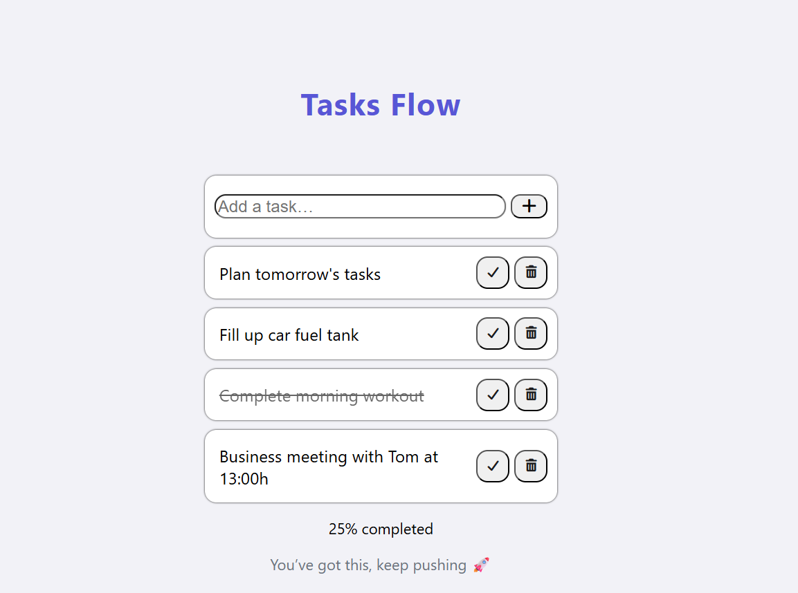
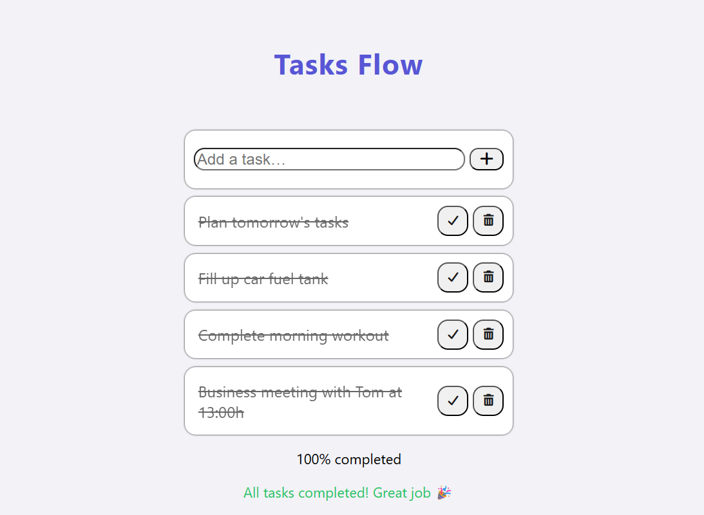

# ToDo App

Modern ToDo application built with HTML, CSS and JavaScript.

## App Preview
### Task progress in action

User has multiple tasks, some are completed and progress is being tracked in real time.

- 1 task completed
- 3 tasks remaining
- Progress: 25% completed

Message shown:
**"Keep going 💪 you're making progress!"**

### All tasks completed

When all tasks are finished, the app shows a success screen with full completion feedback.

- 100% completed
- All tasks marked as done

Message shown:
**"All tasks completed 🎉 Great job!"**

## Features

* Add new tasks
* Delete tasks with smooth animation
* Mark tasks as completed
* Progress tracking
* Clean and minimal UI

## Technologies Used

* HTML5
* CSS3
* JavaScript

## How to Run

1. Download or clone the project
2. Open `index.html` in your browser

## Author

Made by Milos Ignjatovic
